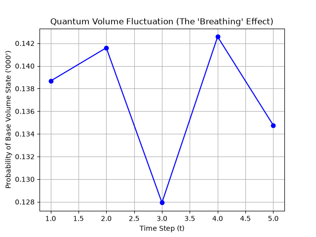

**A qiskit 2.0 primitives project showcasing that space is merely an emergence of quantum relations
rather than a container as assumed in classical (Newtonian) physics.**

## SPIN NETWORK
This was achieved by entangling three qubits together using the cz gate (Controlled-Z gate), to set the qubits
into an entangled state with the results representing the "Area Operator" snapping to its lowest possible physical value:
one Planck area, which locks the qubits into a non-zero entangled state.
The Hadamard gate (qc.h) sets the qubits in superposition.
Remove the cz gates and you end up with an "area" of zero as space no longer exists.

## SPIN FOAMS
Remember the spin network that I just explained above, Spin Foams are basically that but with the
introduction of time. You can Imagine the spin network we built as the **static** "atom" of space. We know that the
universe is in 4D rather than 3D so Spin Foams essentially introduces the concept of time into the Spin Network to make
the 3D spatial geometry (Spin Network) into a 4D spacetime history (Spin Foam) as described by General Relativity.
Let's move away from the theoretical for now and focus on the code to understand how it simulates this phenomenon.
The t represents the state of a space "atom" or spin network after each iteration from 1 through 5. The
for loop facilitates the creation of 3 qubits providing a blank quantum slate before any entanglement occurs.
For the first step, the qc.rx gate rotates the qubits (nodes/knots) causing a change in the spin state of the qubit/node, which results in the volume of the space "atom" also changing. The change in volume
is determined by taking the product of the base Planck volume and multiplying it by a mathematical value derivedz
from the spin state.
From a theoretical standpoint the qc.rx gate represents kinetic energy.
After reaching maximum expansion at a threshold, the volume starts to contract back to its base volume.
This process repeats causing a sort of "breathing" effect that can also be observed after running the code.
This "breathing" effect along with the restructuring of the entanglement lines (cz gates) with respect to the changes in the spin state of the space "atom", is what is known as the passage of time.

#### Terminal output and graph:
```bash
Time Step 1 -> Probability of '000': 0.143 | Total Counts: {'010': 107, '000': 146, '111': 139, '011': 130, '001': 135, '101': 138, '110': 111, '100': 118}
Time Step 2 -> Probability of '000': 0.138 | Total Counts: {'111': 146, '101': 140, '100': 97, '000': 141, '010': 128, '001': 138, '110': 112, '011': 122}
Time Step 3 -> Probability of '000': 0.159 | Total Counts: {'101': 126, '110': 93, '011': 120, '010': 133, '111': 135, '001': 131, '000': 163, '100': 123}
Time Step 4 -> Probability of '000': 0.121 | Total Counts: {'110': 136, '011': 149, '010': 114, '111': 149, '100': 114, '000': 124, '001': 116, '101': 122}
Time Step 5 -> Probability of '000': 0.128 | Total Counts: {'100': 123, '101': 100, '001': 122, '111': 154, '011': 136, '110': 131, '010': 127, '000': 131}
```


***NOTE: Because the measurement at the first iteration occurs after the gate applications, the graph represents the space "atom" at its first state of motion rather than the absolute ground-state volume.***